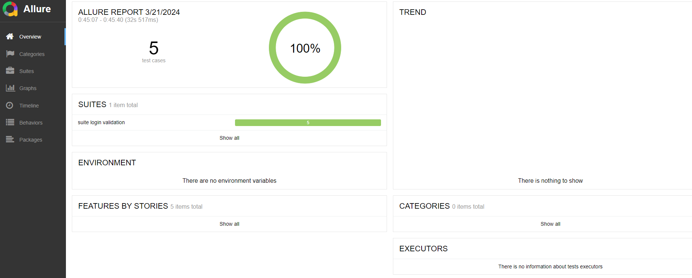
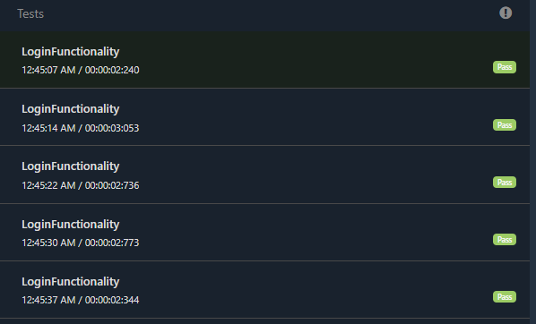

# Project-Mega-Selenium-Framework.
✨ Master-Automation-Selenium-Framework Practice ==> Selenium Test Automation ✨

Data driven testing framework  

Maven build management tools basics

TestNG for test runner

Extent report

allure results 

Git / Github

🎨 Project Design:

Page Object Model design pattern

Data Driven framework

Java OOP

🏗️ Project Structure:

Maven Project

           src / main / java

           src / main / test

🔊 this project included
📦️  packages in src/main/java
pages  

    LandingPage

resources

    Data.xlsx
    DataDriven
    ExtentReporterNG
    GetDataFromExcelintoDatadriver

Utilities

    DataUtils
    LogUtils
    Utility
    WaitsUtils

📦️  packages in src/test/java

tests

    BaseTest
    Feature001_VerifyLoginTest
 
resources

    config.properties
    BrowserName=chrome

testData

    DataReader
    Listeners
    Login.json

⚗️ xml files
- LoginFunctionality.xml

🧱Reports
- mvn test
